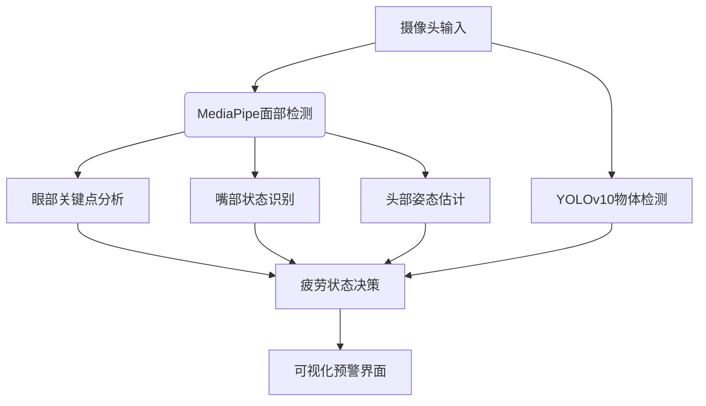

# VigilEye - 智能驾驶员疲劳监测系统


## 功能特性
✅ 实时眼部状态检测  
✅ 哈欠频率分析  
✅ 头部姿态估计  
✅ 违规行为识别（手机/饮食）  
✅ 多语言警告系统  

## 快速开始
```bash
git clone https://github.com/yourname/vigileye-dms.git
cd vigileye-dms
pip install -r requirements.txt
python main.py
```

## 技术架构

## 贡献指南
欢迎提交 PR，请确保：
- 通过 `pylint` 检查（评分≥8.0）
- 添加相应的单元测试
- 更新文档说明
